# Interactive Mermaid Diagrams

> **MarkView** brings your diagrams to life with beautiful, interactive Mermaid visualization.
>
> Click the expand button (top-right corner) to **open fullscreen** view with **pan and zoom** capabilities for detailed exploration.

## OAuth 2.0 Authorization Flow

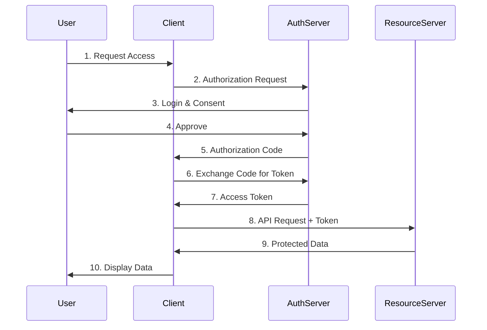
```mermaid
sequenceDiagram
    participant User
    participant Client
    participant AuthServer
    participant ResourceServer

    User->>Client: 1. Request Access
    Client->>AuthServer: 2. Authorization Request
    AuthServer->>User: 3. Login & Consent
    User->>AuthServer: 4. Approve
    AuthServer->>Client: 5. Authorization Code
    Client->>AuthServer: 6. Exchange Code for Token
    AuthServer->>Client: 7. Access Token
    Client->>ResourceServer: 8. API Request + Token
    ResourceServer->>Client: 9. Protected Data
    Client->>User: 10. Display Data
```

---

## Application Architecture (Microservices)

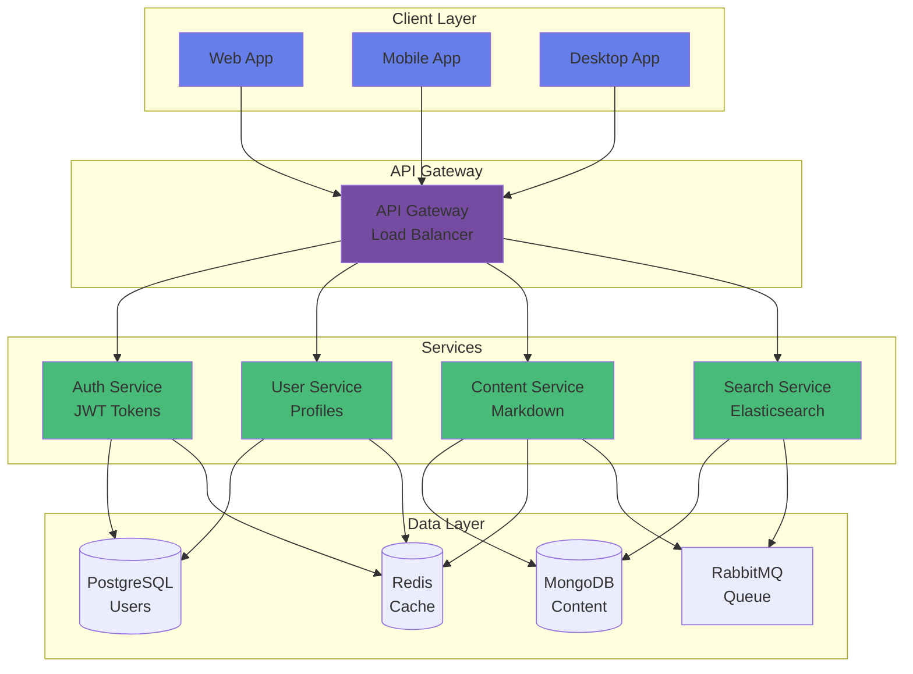
```mermaid
graph TB
    subgraph Client Layer
        Web[Web App]
        Mobile[Mobile App]
        Desktop[Desktop App]
    end

    subgraph API Gateway
        Gateway[API Gateway<br/>Load Balancer]
    end

    subgraph Services
        Auth[Auth Service<br/>JWT Tokens]
        User[User Service<br/>Profiles]
        Content[Content Service<br/>Markdown]
        Search[Search Service<br/>Elasticsearch]
    end

    subgraph Data Layer
        DB1[(PostgreSQL<br/>Users)]
        DB2[(MongoDB<br/>Content)]
        Cache[(Redis<br/>Cache)]
        Queue[RabbitMQ<br/>Queue]
    end

    Web --> Gateway
    Mobile --> Gateway
    Desktop --> Gateway

    Gateway --> Auth
    Gateway --> User
    Gateway --> Content
    Gateway --> Search

    Auth --> DB1
    User --> DB1
    Content --> DB2
    Search --> DB2

    Auth --> Cache
    User --> Cache
    Content --> Cache

    Content --> Queue
    Search --> Queue

    style Web fill:#667eea
    style Mobile fill:#667eea
    style Desktop fill:#667eea
    style Gateway fill:#764ba2
    style Auth fill:#48bb78
    style User fill:#48bb78
    style Content fill:#48bb78
    style Search fill:#48bb78
```

---

## Development Workflow (CI/CD Pipeline)

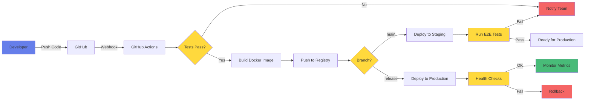
```mermaid
flowchart LR
    A[Developer] -->|Push Code| B[GitHub]
    B -->|Webhook| C[GitHub Actions]

    C --> D{Tests Pass?}
    D -->|No| E[Notify Team]
    D -->|Yes| F[Build Docker Image]

    F --> G[Push to Registry]
    G --> H{Branch?}

    H -->|main| I[Deploy to Staging]
    H -->|release| J[Deploy to Production]

    I --> K[Run E2E Tests]
    K -->|Pass| L[Ready for Production]
    K -->|Fail| E

    J --> M[Health Checks]
    M -->|OK| N[Monitor Metrics]
    M -->|Fail| O[Rollback]

    style A fill:#667eea
    style D fill:#ffd93d
    style H fill:#ffd93d
    style K fill:#ffd93d
    style M fill:#ffd93d
    style N fill:#48bb78
    style O fill:#f56565
    style E fill:#f56565
```

---

## State Management

### Redux Store Architecture

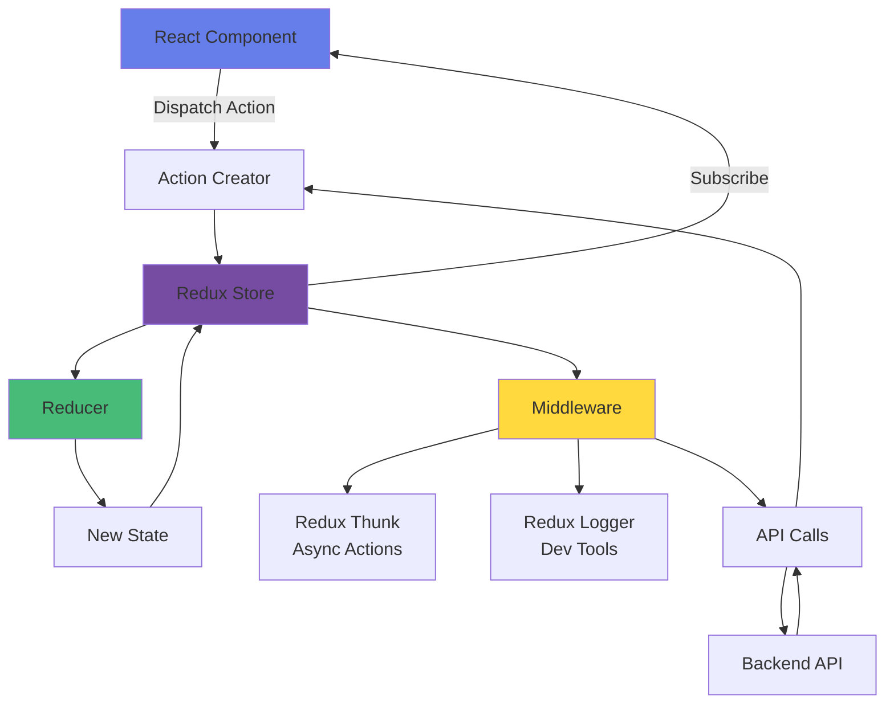
```mermaid
graph TD
    A[React Component] -->|Dispatch Action| B[Action Creator]
    B --> C[Redux Store]
    C --> D[Reducer]
    D --> E[New State]
    E --> C
    C -->|Subscribe| A

    C --> F[Middleware]
    F --> G[Redux Thunk<br/>Async Actions]
    F --> H[Redux Logger<br/>Dev Tools]
    F --> I[API Calls]

    I --> J[Backend API]
    J --> I
    I --> B

    style A fill:#667eea
    style C fill:#764ba2
    style D fill:#48bb78
    style F fill:#ffd93d
```

---

### SVG Pan-Zoom Interaction

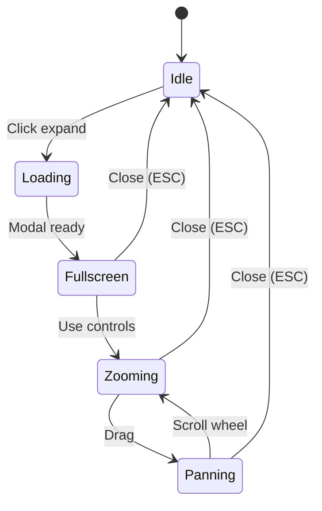
```mermaid
stateDiagram-v2
    [*] --> Idle
    Idle --> Loading : Click expand
    Loading --> Fullscreen : Modal ready
    Fullscreen --> Zooming : Use controls
    Zooming --> Panning : Drag
    Panning --> Zooming : Scroll wheel
    Fullscreen --> Idle : Close (ESC)
    Zooming --> Idle : Close (ESC)
    Panning --> Idle : Close (ESC)
```

---

## Database Schema

### User & Content Relationships

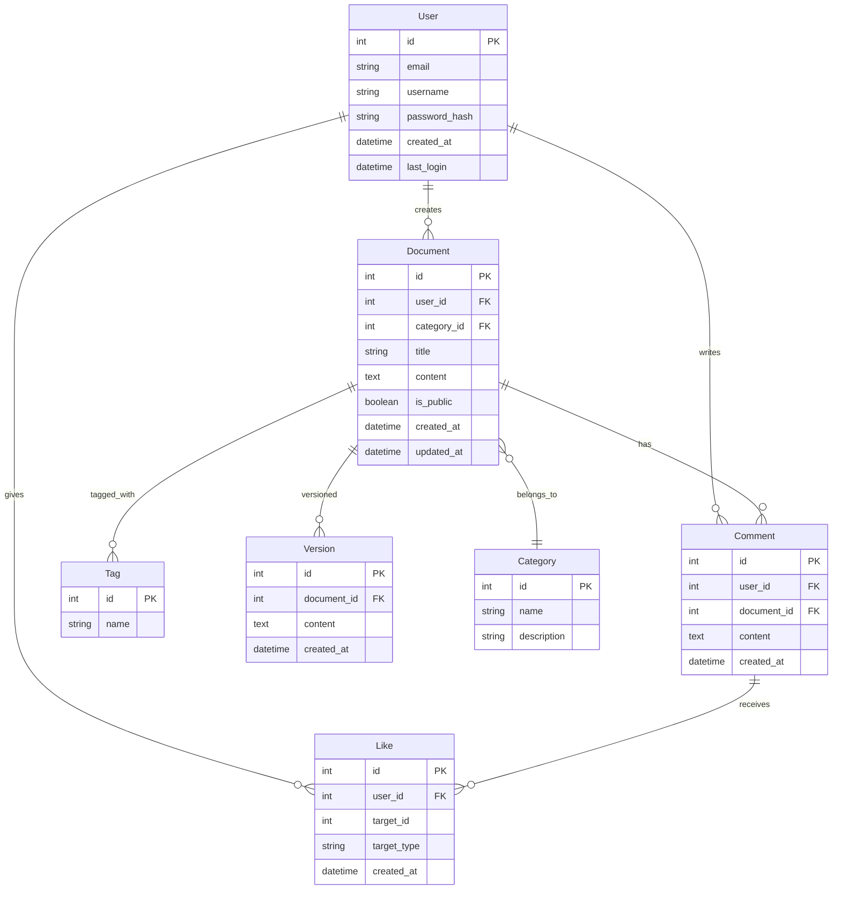
```mermaid
erDiagram
    User ||--o{ Document : creates
    User ||--o{ Comment : writes
    User ||--o{ Like : gives
    Document ||--o{ Comment : has
    Document ||--o{ Tag : tagged_with
    Document ||--o{ Version : versioned
    Document }o--|| Category : belongs_to
    Comment ||--o{ Like : receives

    User {
        int id PK
        string email
        string username
        string password_hash
        datetime created_at
        datetime last_login
    }

    Document {
        int id PK
        int user_id FK
        int category_id FK
        string title
        text content
        boolean is_public
        datetime created_at
        datetime updated_at
    }

    Comment {
        int id PK
        int user_id FK
        int document_id FK
        text content
        datetime created_at
    }

    Category {
        int id PK
        string name
        string description
    }

    Tag {
        int id PK
        string name
    }

    Version {
        int id PK
        int document_id FK
        text content
        datetime created_at
    }

    Like {
        int id PK
        int user_id FK
        int target_id
        string target_type
        datetime created_at
    }
```

---

### Entity-Relationship Diagram

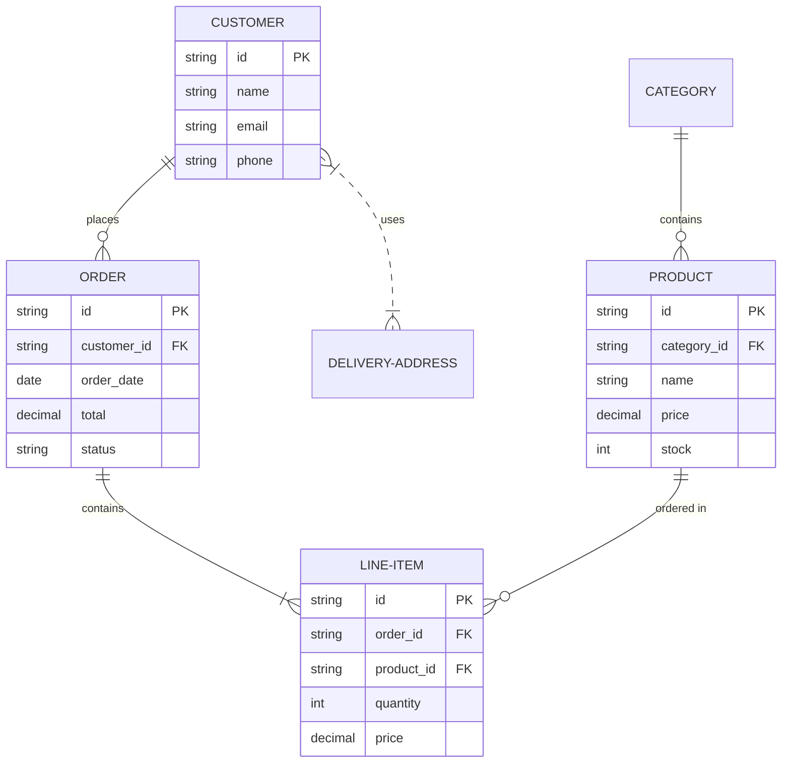
```mermaid
erDiagram
    CUSTOMER ||--o{ ORDER : places
    ORDER ||--|{ LINE-ITEM : contains
    CUSTOMER }|..|{ DELIVERY-ADDRESS : uses
    PRODUCT ||--o{ LINE-ITEM : "ordered in"
    CATEGORY ||--o{ PRODUCT : contains
    
    CUSTOMER {
        string id PK
        string name
        string email
        string phone
    }
    
    ORDER {
        string id PK
        string customer_id FK
        date order_date
        decimal total
        string status
    }
    
    LINE-ITEM {
        string id PK
        string order_id FK
        string product_id FK
        int quantity
        decimal price
    }
    
    PRODUCT {
        string id PK
        string category_id FK
        string name
        decimal price
        int stock
    }
```

---

## Project Timeline (Feature Development Roadmap)

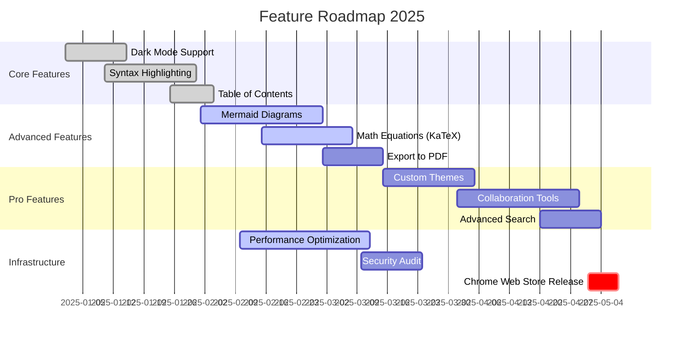
```mermaid
gantt
    title Feature Roadmap 2025
    dateFormat  YYYY-MM-DD
    section Core Features
    Dark Mode Support           :done,    core1, 2025-01-01, 14d
    Syntax Highlighting        :done,    core2, 2025-01-10, 21d
    Table of Contents          :done,    core3, 2025-01-25, 10d

    section Advanced Features
    Mermaid Diagrams           :active,  adv1, 2025-02-01, 28d
    Math Equations (KaTeX)     :active,  adv2, 2025-02-15, 21d
    Export to PDF              :         adv3, 2025-03-01, 14d

    section Pro Features
    Custom Themes              :         pro1, 2025-03-15, 21d
    Collaboration Tools        :         pro2, 2025-04-01, 28d
    Advanced Search            :         pro3, 2025-04-20, 14d

    section Infrastructure
    Performance Optimization   :active,  infra1, 2025-02-10, 30d
    Security Audit            :         infra2, 2025-03-10, 14d
    Chrome Web Store Release  :crit,    infra3, 2025-05-01, 7d
```

---

## Git Workflow (Feature Branch Strategy)

```mermaid
gitgraph
    commit id: "Initial commit"
    commit id: "Setup project structure"

    branch develop
    checkout develop
    commit id: "Add base components"

    branch feature/dark-mode
    checkout feature/dark-mode
    commit id: "Implement dark theme"
    commit id: "Add theme toggle"

    checkout develop
    merge feature/dark-mode
    commit id: "Update documentation"

    branch feature/mermaid
    checkout feature/mermaid
    commit id: "Add mermaid support"
    commit id: "Fix diagram rendering"

    checkout develop
    merge feature/mermaid

    checkout main
    merge develop tag: "v1.0.0"

    checkout develop
    branch feature/math
    checkout feature/math
    commit id: "Add KaTeX integration"

    checkout develop
    branch feature/export
    checkout feature/export
    commit id: "Implement PDF export"

    checkout develop
    merge feature/math
    merge feature/export

    checkout main
    merge develop tag: "v1.1.0"
```

---

## Decision Tree (Content Rendering Logic)

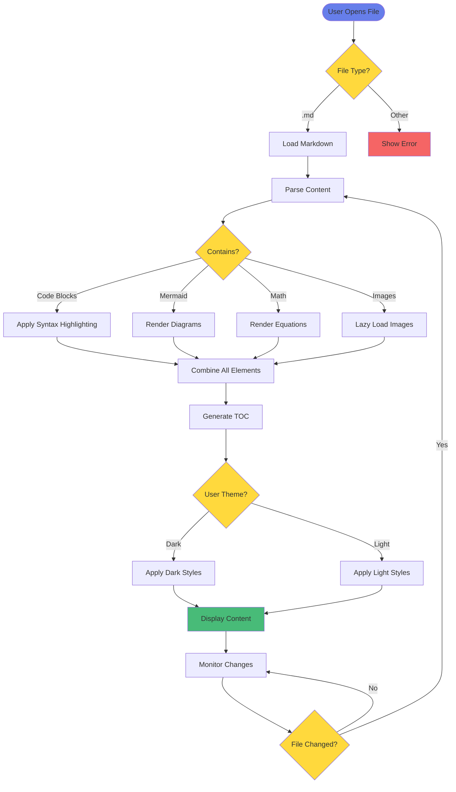
```mermaid
flowchart TD
    Start([User Opens File]) --> CheckType{File Type?}

    CheckType -->|.md| LoadMD[Load Markdown]
    CheckType -->|Other| Error[Show Error]

    LoadMD --> Parse[Parse Content]
    Parse --> CheckFeatures{Contains?}

    CheckFeatures -->|Code Blocks| Highlight[Apply Syntax Highlighting]
    CheckFeatures -->|Mermaid| Diagram[Render Diagrams]
    CheckFeatures -->|Math| Equation[Render Equations]
    CheckFeatures -->|Images| LazyLoad[Lazy Load Images]

    Highlight --> Combine
    Diagram --> Combine
    Equation --> Combine
    LazyLoad --> Combine

    Combine[Combine All Elements] --> BuildTOC[Generate TOC]
    BuildTOC --> ApplyTheme{User Theme?}

    ApplyTheme -->|Dark| DarkCSS[Apply Dark Styles]
    ApplyTheme -->|Light| LightCSS[Apply Light Styles]

    DarkCSS --> Display[Display Content]
    LightCSS --> Display

    Display --> Monitor[Monitor Changes]
    Monitor --> Update{File Changed?}

    Update -->|Yes| Parse
    Update -->|No| Monitor

    style Start fill:#667eea
    style Display fill:#48bb78
    style Error fill:#f56565
    style CheckType fill:#ffd93d
    style CheckFeatures fill:#ffd93d
    style ApplyTheme fill:#ffd93d
    style Update fill:#ffd93d
```

---

## Component Hierarchy (React Component Tree)

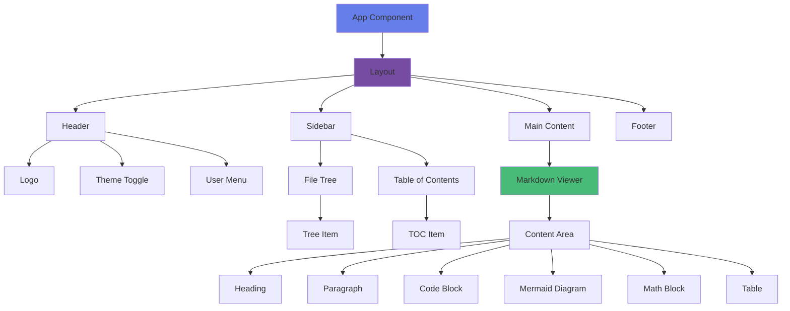
```mermaid
graph TD
    App[App Component] --> Layout[Layout]

    Layout --> Header[Header]
    Layout --> Sidebar[Sidebar]
    Layout --> Main[Main Content]
    Layout --> Footer[Footer]

    Header --> Logo[Logo]
    Header --> ThemeToggle[Theme Toggle]
    Header --> UserMenu[User Menu]

    Sidebar --> FileTree[File Tree]
    Sidebar --> TOC[Table of Contents]

    FileTree --> TreeItem[Tree Item]
    TOC --> TOCItem[TOC Item]

    Main --> Viewer[Markdown Viewer]

    Viewer --> ContentArea[Content Area]
    ContentArea --> Heading[Heading]
    ContentArea --> Paragraph[Paragraph]
    ContentArea --> CodeBlock[Code Block]
    ContentArea --> MermaidDiagram[Mermaid Diagram]
    ContentArea --> MathBlock[Math Block]
    ContentArea --> Table[Table]

    style App fill:#667eea
    style Layout fill:#764ba2
    style Viewer fill:#48bb78
```

---

## Class Diagram (OOP Design Pattern - Strategy Pattern)

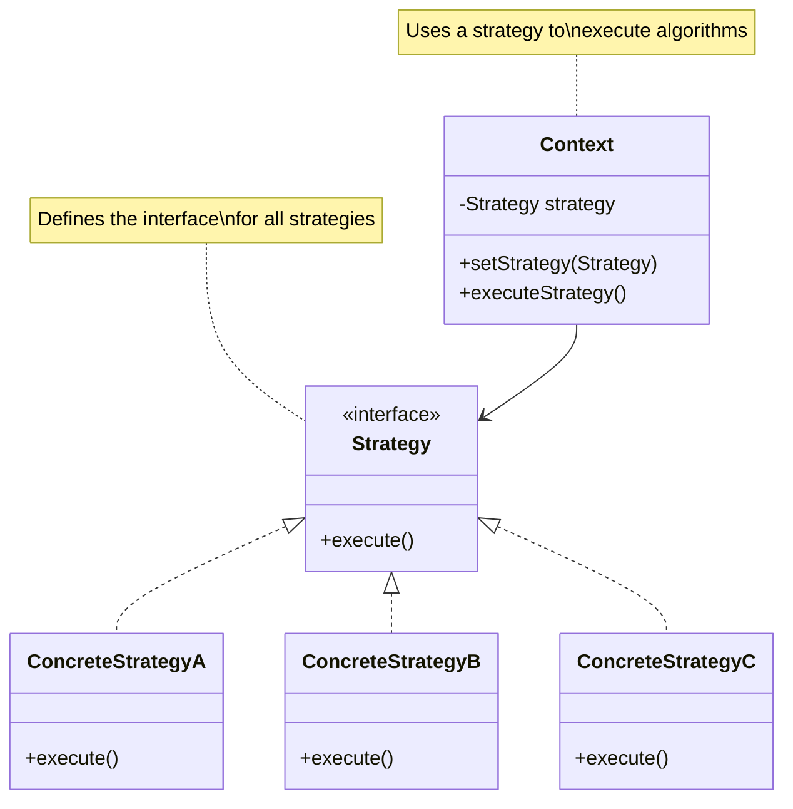
```mermaid
classDiagram
    class Context {
        -Strategy strategy
        +setStrategy(Strategy)
        +executeStrategy()
    }

    class Strategy {
        <<interface>>
        +execute()
    }

    class ConcreteStrategyA {
        +execute()
    }

    class ConcreteStrategyB {
        +execute()
    }

    class ConcreteStrategyC {
        +execute()
    }

    Context --> Strategy
    Strategy <|.. ConcreteStrategyA
    Strategy <|.. ConcreteStrategyB
    Strategy <|.. ConcreteStrategyC

    note for Context "Uses a strategy to\nexecute algorithms"
    note for Strategy "Defines the interface\nfor all strategies"
```

---

## State Diagram (User Session Management)

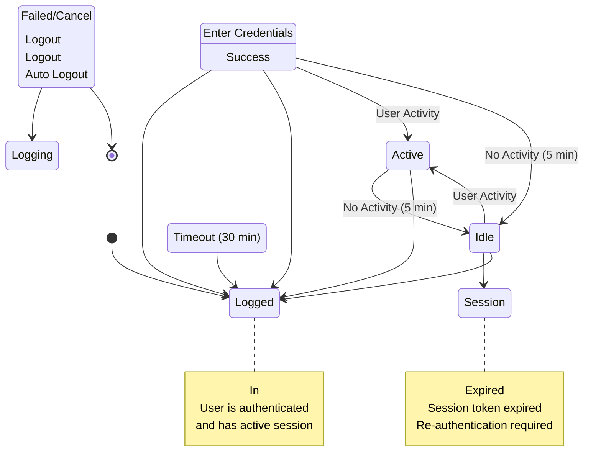
```mermaid
stateDiagram-v2
    [*] --> Logged Out

    Logged Out --> Logging In: Enter Credentials
    Logging In --> Logged In: Success
    Logging In --> Logged Out: Failed/Cancel

    Logged In --> Active: User Activity
    Logged In --> Idle: No Activity (5 min)

    Active --> Idle: No Activity (5 min)
    Idle --> Active: User Activity
    Idle --> Session Expired: Timeout (30 min)

    Active --> Logged Out: Logout
    Idle --> Logged Out: Logout
    Session Expired --> Logged Out: Auto Logout

    Logged Out --> [*]

    note right of Logged In
        User is authenticated
        and has active session
    end note

    note right of Session Expired
        Session token expired
        Re-authentication required
    end note
```

---

## Pie Chart (Technology Stack Distribution)

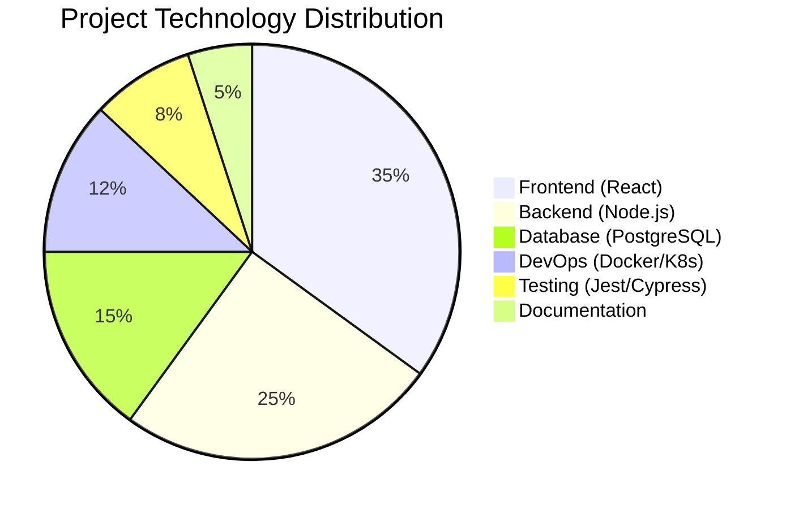
```mermaid
pie title Project Technology Distribution
    "Frontend (React)" : 35
    "Backend (Node.js)" : 25
    "Database (PostgreSQL)" : 15
    "DevOps (Docker/K8s)" : 12
    "Testing (Jest/Cypress)" : 8
    "Documentation" : 5
```

---

## User Journey (New User Onboarding Experience)

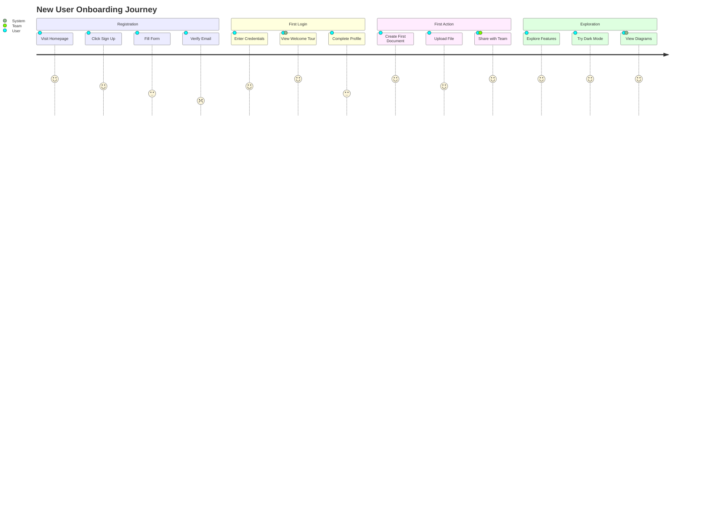
```mermaid
journey
    title New User Onboarding Journey
    section Registration
      Visit Homepage: 5: User
      Click Sign Up: 4: User
      Fill Form: 3: User
      Verify Email: 2: User
    section First Login
      Enter Credentials: 4: User
      View Welcome Tour: 5: User, System
      Complete Profile: 3: User
    section First Action
      Create First Document: 5: User
      Upload File: 4: User
      Share with Team: 5: User, Team
    section Exploration
      Explore Features: 5: User
      Try Dark Mode: 5: User
      View Diagrams: 5: User, System
```

---

## Mindmap (Feature Overview)

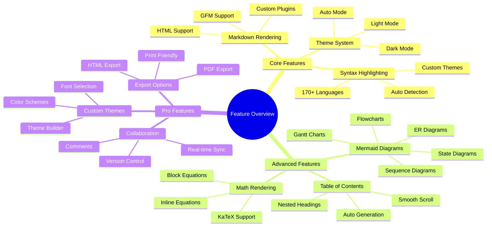
```mermaid
mindmap
  root((Feature Overview))
    Core Features
      Markdown Rendering
        GFM Support
        HTML Support
        Custom Plugins
      Syntax Highlighting
        170+ Languages
        Auto Detection
        Custom Themes
      Theme System
        Light Mode
        Dark Mode
        Auto Mode
    Advanced Features
      Mermaid Diagrams
        Flowcharts
        Sequence Diagrams
        ER Diagrams
        State Diagrams
        Gantt Charts
      Math Rendering
        Inline Equations
        Block Equations
        KaTeX Support
      Table of Contents
        Auto Generation
        Smooth Scroll
        Nested Headings
    Pro Features
      Export Options
        PDF Export
        HTML Export
        Print Friendly
      Collaboration
        Real-time Sync
        Comments
        Version Control
      Custom Themes
        Theme Builder
        Color Schemes
        Font Selection
```

---

## Timeline (Project Milestones)

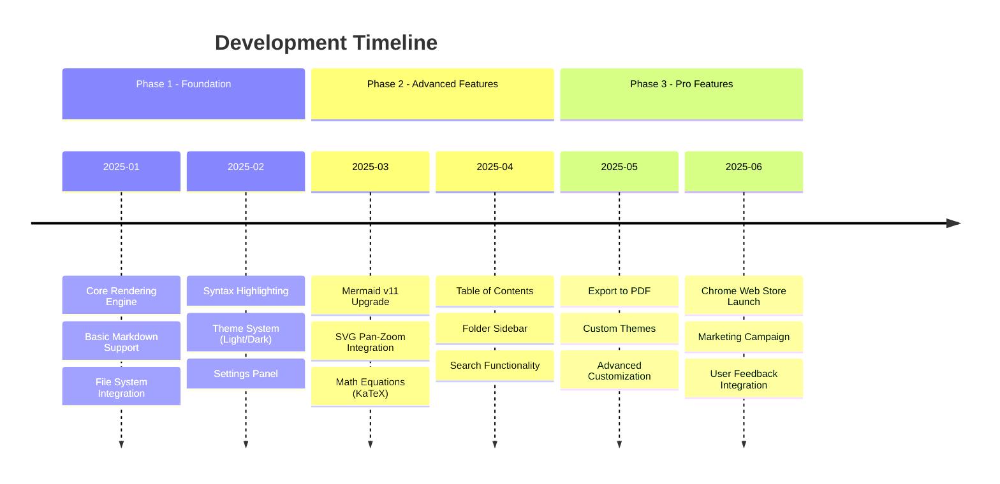
```mermaid
timeline
    title Development Timeline
    section Phase 1 - Foundation
        2025-01 : Core Rendering Engine
               : Basic Markdown Support
               : File System Integration
        2025-02 : Syntax Highlighting
               : Theme System (Light/Dark)
               : Settings Panel
    section Phase 2 - Advanced Features
        2025-03 : Mermaid v11 Upgrade
               : SVG Pan-Zoom Integration
               : Math Equations (KaTeX)
        2025-04 : Table of Contents
               : Folder Sidebar
               : Search Functionality
    section Phase 3 - Pro Features
        2025-05 : Export to PDF
               : Custom Themes
               : Advanced Customization
        2025-06 : Chrome Web Store Launch
               : Marketing Campaign
               : User Feedback Integration
```

---

## Quadrant Chart (Feature Prioritization Matrix)

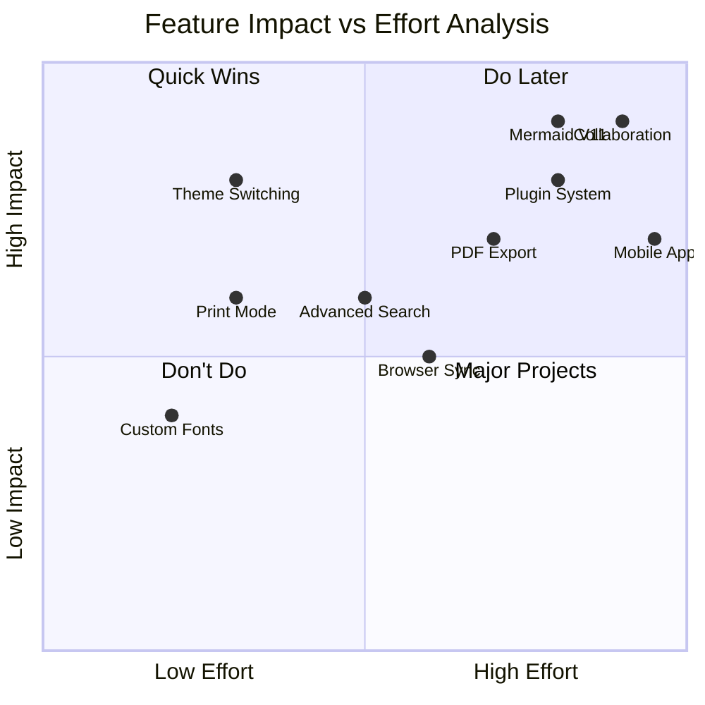
```mermaid
quadrantChart
    title Feature Impact vs Effort Analysis
    x-axis Low Effort --> High Effort
    y-axis Low Impact --> High Impact
    quadrant-1 Do Later
    quadrant-2 Quick Wins
    quadrant-3 Don't Do
    quadrant-4 Major Projects

    Mermaid V11: [0.8, 0.9]
    Theme Switching: [0.3, 0.8]
    PDF Export: [0.7, 0.7]
    Custom Fonts: [0.2, 0.4]
    Collaboration: [0.9, 0.9]
    Print Mode: [0.3, 0.6]
    Mobile App: [0.95, 0.7]
    Browser Sync: [0.6, 0.5]
    Advanced Search: [0.5, 0.6]
    Plugin System: [0.8, 0.8]
```

---

## Sankey Diagram (User Traffic Flow)

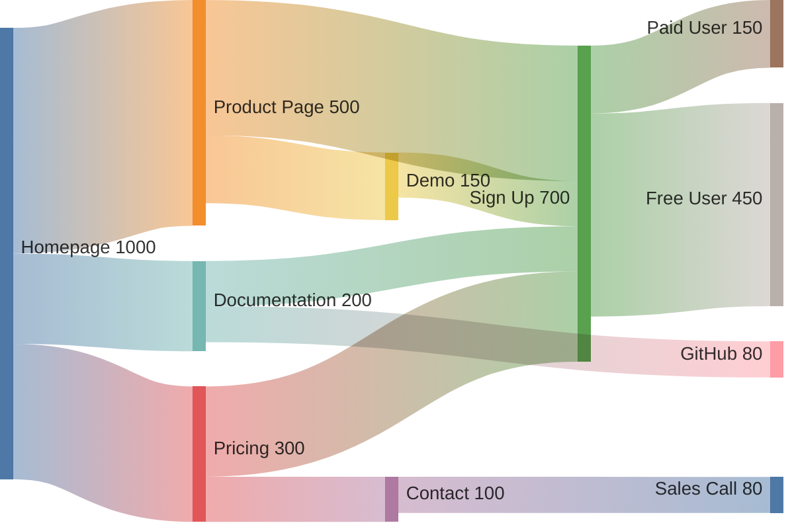
```mermaid
sankey-beta

Homepage,Product Page,500
Homepage,Pricing,300
Homepage,Documentation,200
Product Page,Sign Up,300
Product Page,Demo,150
Pricing,Sign Up,200
Pricing,Contact,100
Documentation,Sign Up,100
Documentation,GitHub,80
Sign Up,Paid User,150
Sign Up,Free User,450
Demo,Sign Up,100
Contact,Sales Call,80
```

This comprehensive diagram collection now showcases **16 different Mermaid diagram types** supported in v11! 🎨✨

### Diagram Types Included

1. **Sequence Diagram** - OAuth Flow
2. **Flowchart (Graph TB)** - Microservices Architecture
3. **Flowchart (LR)** - CI/CD Pipeline
4. **Graph (TD)** - State Management
5. **ER Diagram** - Database Schema
6. **Gantt Chart** - Project Roadmap
7. **Git Graph** - Feature Branch Strategy
8. **Flowchart (TD)** - Decision Tree
9. **Graph (TD)** - Component Hierarchy
10. **Class Diagram** - OOP Design Pattern
11. **State Diagram** - Session Management
12. **Pie Chart** - Tech Stack Distribution
13. **User Journey** - Onboarding Experience
14. **Mindmap** - Feature Overview
15. **Timeline** - Project Milestones
16. **Quadrant Chart** - Prioritization Matrix
17. **Sankey Diagram** - Traffic Flow
